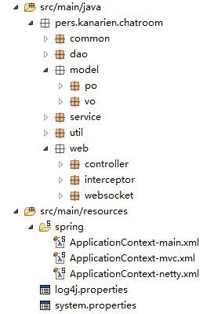

## Spring整合Netty、WebSocket的互联网聊天系统

### 0.前言

最近一段时间在学习Netty网络框架，又趁着计算机网络的课程设计，决定以Netty为核心，以WebSocket为应用层通信协议做一个互联网聊天系统，整体而言就像微信网页版一样，但考虑到这个聊天系统的功能非常多，因此只打算实现核心的聊天功能，包括单发、群发、文件发送，然后把项目与Spring整合做成开源、可拓展的方式，给大家参考、讨论、使用，欢迎大家的指点。

关于Netty

> Netty 是一个利用 Java 的高级网络的能力，隐藏其背后的复杂性而提供一个易于使用的 API 的客户端/服务器框架。

这里借用《Essential Netty In Action》的一句话来简单介绍Netty，详细的可参考阅读该书的电子版

- [Essential Netty in Action 《Netty 实战(精髓)》](https://legacy.gitbook.com/book/waylau/essential-netty-in-action/details)

关于WebSocket通信协议
简单说一下WebSocket通信协议，WebSocket是为了解决HTTP协议中通信只能由客户端发起这个弊端而出现的，WebSocket基于HTTP5协议，借用HTTP进行握手、升级，能够做到轻量的、高效的、双向的在客户端和服务端之间传输文本数据。详细可参考以下文章：

- [WebSocket 是什么原理？为什么可以实现持久连接？](https://www.zhihu.com/question/20215561)
- [WebSocket 教程 - 阮一峰的网络日志](http://www.ruanyifeng.com/blog/2017/05/websocket.html)

## 1. 技术准备

- 操作平台：Windows 7, 64bit 8G
- IDE：MyEclipse 2016
- JDK版本：1.8.0_121
- 浏览器：谷歌浏览器、360浏览器（极速模式）（涉及网页前端设计，后端开发表示很苦闷）
- 涉及技术：
  - Netty 4
  - WebSocket + HTTP
  - Spring MVC + Spring
  - JQuery
  - Bootstrap 3 + Bootstrap-fileinput
  - Maven 3.5
  - Tomcat 8.0

## 2. 整体说明

### 2.1 设计思想

整个通信系统**以Tomcat作为核心服务器运行，其下另开一个线程运行Netty WebSocket服务器**，Tomcat服务器主要处理客户登录、个人信息管理等的HTTP类型请求（通常的业务类型），端口为8080，Netty WebSockt服务器主要处理用户消息通信的WebSocket类型请求，端口为3333。用户通过浏览器登录后，浏览器会维持一个Session对象（有效时间30分钟）来保持登录状态，Tomcat服务器会返回用户的个人信息，同时记录在线用户，**根据用户id建立一条WebSocket连接并保存在后端以便进行实时通信**。当一个用户向另一用户发起通信，服务器会根据消息内容中的对话方用户id，找到保存的WebSocket连接，通过该连接发送消息，对方就能够收到即时收到消息。当用户注销或退出时，释放WebSocket连接，清空Session对象中的登录状态。

事实上Netty也可以用作一个HTTP服务器，而这里使用Spring MVC处理HTTP请求是出于熟悉的缘故，也比较接近传统开发的方式。

### 2.2 系统结构

系统采用B/S（Browser/Server），即浏览器/服务器的结构，主要事务逻辑在服务器端（Server）实现。借鉴MVC模式的思想，从上至下具体又分为视图层（View）、控制层（Controller）、业务层（Service）、模型层（Model）、数据访问层（Data Access）

### 2.3 项目结构

项目后端结构：



项目前端结构：


### 2.4 系统功能模块

系统只包括两个模块：登录模块和聊天管理模块。

- 登录模块：既然作为一个系统，那么登录的角色认证是必不可少的，这里使用简单、传统的Session方式维持登录状态，当然也有对应的注销功能，但这里的注销除了清空Session对象，还要释放WebSocket连接，否则造成内存泄露。

- 聊天管理模块：系统的核心模块，这部分主要使用Netty框架实现，功能包括信息、文件的单条和多条发送，也支持表情发送。

- 其他模块：如好友管理模块、聊天记录管理、注册模块等，我并没有实现，有兴趣的话可以自行实现，与传统的开发方式类似。

  

到这里，可能会有人出现疑问了，首先是前面的涉及技术中没有ORM框架（Mybatis或Hibernate），这里又没有实现好友管理的功能，那用户如何确定自己的好友并发送信息呢？
其实，这里我在dao层的实现里并没有连接数据库，而是用硬编码的方式固定好系统的用户以及用户的好友表、群组表，之所以这么做是因为当初考虑到这个课程设计要是连接数据库就太麻烦了光是已有的模块（包括前后端）就差不多3k行代码了，时间上十分划不来，于是就用了硬编码的方式~~偷懒~~，后面会再说明系统用户的情况。

### 2.5 用户状态转换图

由于本系统涉及多个用户状态，有必要进行说明，下面给出本系统的用户状态转换图。


### 2.6 系统界面

系统聊天界面如下：


## 3. 核心编码

### 3.1 Netty WebSocket服务端

#### 3.1.1 Netty服务器启动与关闭

不得不说的是，当关闭Tomcat服务器时，也要释放Netty相关资源，否则会造成内存泄漏，关闭方法如下面的`close()`，如果只是使用`shutdownGracefully()`方法的话，关闭时会报内存泄露Memory Leak异常（但IDE可能来不及输出到控制台）

```
/**
 * 描述: Netty WebSocket服务器
 *      使用独立的线程启动
 * @author Kanarien
 * @version 1.0
 * @date 2018年5月18日 上午11:22:51
 */
public class WebSocketServer implements Runnable{

    private final Logger logger = LoggerFactory.getLogger(WebSocketServer.class);

    @Autowired
    private EventLoopGroup bossGroup;
    @Autowired
    private EventLoopGroup workerGroup;
    @Autowired
    private ServerBootstrap serverBootstrap;

    private int port;
    private ChannelHandler childChannelHandler;
    private ChannelFuture serverChannelFuture;

  // 构造方法少了会报错
    public WebSocketServer() {}

    @Override
    public void run() {
        build();
    }

    /**
     * 描述：启动Netty Websocket服务器
     */
    public void build() {
        try {
      long begin = System.currentTimeMillis();
    serverBootstrap.group(bossGroup, workerGroup) //boss辅助客户端的tcp连接请求  worker负责与客户端之前的读写操作
             .channel(NioServerSocketChannel.class) //配置客户端的channel类型
             .option(ChannelOption.SO_BACKLOG, 1024) //配置TCP参数，握手字符串长度设置
             .option(ChannelOption.TCP_NODELAY, true) //TCP_NODELAY算法，尽可能发送大块数据，减少充斥的小块数据
             .childOption(ChannelOption.SO_KEEPALIVE, true)//开启心跳包活机制，就是客户端、服务端建立连接处于ESTABLISHED状态，超过2小时没有交流，机制会被启动
             .childOption(ChannelOption.RCVBUF_ALLOCATOR, new FixedRecvByteBufAllocator(592048))//配置固定长度接收缓存区分配器
             .childHandler(childChannelHandler); //绑定I/O事件的处理类,WebSocketChildChannelHandler中定义
    long end = System.currentTimeMillis();
            logger.info("Netty Websocket服务器启动完成，耗时 " + (end - begin) + " ms，已绑定端口 " + port + " 阻塞式等候客户端连接");

            serverChannelFuture = serverBootstrap.bind(port).sync();
        } catch (Exception e) {
            logger.info(e.getMessage());
            bossGroup.shutdownGracefully();
            workerGroup.shutdownGracefully();
            e.printStackTrace();
        }

    }

  /**
     * 描述：关闭Netty Websocket服务器，主要是释放连接
     *     连接包括：服务器连接serverChannel，
     *     客户端TCP处理连接bossGroup，
     *     客户端I/O操作连接workerGroup
     *
     *     若只使用
     *         bossGroupFuture = bossGroup.shutdownGracefully();
     *         workerGroupFuture = workerGroup.shutdownGracefully();
     *     会造成内存泄漏。
     */
    public void close(){
        serverChannelFuture.channel().close();
        Future<?> bossGroupFuture = bossGroup.shutdownGracefully();
        Future<?> workerGroupFuture = workerGroup.shutdownGracefully();

        try {
            bossGroupFuture.await();
            workerGroupFuture.await();
        } catch (InterruptedException ignore) {
            ignore.printStackTrace();
        }
    }

    public ChannelHandler getChildChannelHandler() {
        return childChannelHandler;
    }

    public void setChildChannelHandler(ChannelHandler childChannelHandler) {
        this.childChannelHandler = childChannelHandler;
    }

    public int getPort() {
        return port;
    }

    public void setPort(int port) {
        this.port = port;
    }

}
```

#### 3.1.2 Netty服务器处理链

独立出处理器链类，方便修改与注入，免得混在一起显得混乱。

```
@Component
public class WebSocketChildChannelHandler extends ChannelInitializer<SocketChannel>{

    @Resource(name = "webSocketServerHandler")
    private ChannelHandler webSocketServerHandler;

    @Resource(name = "httpRequestHandler")
    private ChannelHandler httpRequestHandler;

    @Override
    protected void initChannel(SocketChannel ch) throws Exception {
        ch.pipeline().addLast("http-codec", new HttpServerCodec()); // HTTP编码解码器
        ch.pipeline().addLast("aggregator", new HttpObjectAggregator(65536)); // 把HTTP头、HTTP体拼成完整的HTTP请求
        ch.pipeline().addLast("http-chunked", new ChunkedWriteHandler()); // 分块，方便大文件传输，不过实质上都是短的文本数据
        ch.pipeline().addLast("http-handler", httpRequestHandler);
        ch.pipeline().addLast("websocket-handler",webSocketServerHandler);
    }

}
```

#### 3.1.3 Netty服务器HTTP请求处理器

值得一提的是，当在处理链中使用Spring注入处理器的bean的时候，如果处理器类不使用@Sharable标签的话，会出现错误。如果不使用Spring注入bean的方式，那么应该new一个新的处理器对象，如`ch.pipeline().addLast("http-handler", new HttpRequestHandler())`。另外，判断HTTP请求还是WebSocket请求的方式稍微不太优雅，但我按照《Essential Netty in Action》中的方法去试，结果有问题的，只好用下面的if语句判断。

```
@Component
@Sharable
public class HttpRequestHandler extends SimpleChannelInboundHandler<Object> {

    /**
     * 描述：读取完连接的消息后，对消息进行处理。
     * 这里仅处理HTTP请求，WebSocket请求交给下一个处理器。
     */
    @Override
    protected void channelRead0(ChannelHandlerContext ctx, Object msg) throws Exception {
        if (msg instanceof FullHttpRequest) {
            handleHttpRequest(ctx, (FullHttpRequest) msg);
        } else if (msg instanceof WebSocketFrame) {
            ctx.fireChannelRead(((WebSocketFrame) msg).retain());
        }
    }

    /**
     * 描述：处理Http请求，主要是完成HTTP协议到Websocket协议的升级
     * @param ctx
     * @param req
     */
    private void handleHttpRequest(ChannelHandlerContext ctx, FullHttpRequest req) {
        if (!req.decoderResult().isSuccess()) {
            sendHttpResponse(ctx, req,
                    new DefaultFullHttpResponse(HttpVersion.HTTP_1_1, HttpResponseStatus.BAD_REQUEST));
            return;
        }

        WebSocketServerHandshakerFactory wsFactory = new WebSocketServerHandshakerFactory(
                "ws:/" + ctx.channel() + "/websocket", null, false);
        WebSocketServerHandshaker handshaker = wsFactory.newHandshaker(req);
        Constant.webSocketHandshakerMap.put(ctx.channel().id().asLongText(), handshaker);// 保存握手类到全局变量，方便以后关闭连接

        if (handshaker == null) {
            WebSocketServerHandshakerFactory.sendUnsupportedVersionResponse(ctx.channel());
        } else {
            handshaker.handshake(ctx.channel(), req);
        }
    }

    private void sendHttpResponse(ChannelHandlerContext ctx, FullHttpRequest req, DefaultFullHttpResponse res) {
        // 返回应答给客户端
        if (res.status().code() != 200) {
            ByteBuf buf = Unpooled.copiedBuffer(res.status().toString(), CharsetUtil.UTF_8);
            res.content().writeBytes(buf);
            buf.release();
        }
        // 如果是非Keep-Alive，关闭连接
        boolean keepAlive = HttpUtil.isKeepAlive(req);
        ChannelFuture f = ctx.channel().writeAndFlush(res);
        if (!keepAlive) {
            f.addListener(ChannelFutureListener.CLOSE);
        }
    }

    /**
     * 描述：异常处理，关闭channel
     */
    @Override
    public void exceptionCaught(ChannelHandlerContext ctx, Throwable cause) throws Exception {
        cause.printStackTrace();
        ctx.close();
    }
}
```

#### 3.1.4 Netty服务器WebSocket请求处理器

考虑到规范性与可维护性，switch语句中的case常量应该放在常量类中声明比较好。另外说下群发的逻辑（属于业务逻辑，这里没有给出代码），群发也就是在一个群中发言，后端会扫描群中在线的用户，逐一发送信息。用户的WebSocket连接（即ChannelHandlerContext对象），会保存在全局变量onlineUserMap中，以用户id作键，方便操作连接。关于表情的发送逻辑，与单发逻辑相同，不同的是发送内容为对应的img标签字符串。

```
@Component
@Sharable
public class WebSocketServerHandler extends SimpleChannelInboundHandler<WebSocketFrame> {

    private static final Logger LOGGER = LoggerFactory.getLogger(WebSocketServerHandler.class);

    @Autowired
    private ChatService chatService;

    /**
     * 描述：读取完连接的消息后，对消息进行处理。
     *      这里主要是处理WebSocket请求
     */
    @Override
    protected void channelRead0(ChannelHandlerContext ctx, WebSocketFrame msg) throws Exception {
        handlerWebSocketFrame(ctx, msg);
    }

    /**
     * 描述：处理WebSocketFrame
     * @param ctx
     * @param frame
     * @throws Exception
     */
    private void handlerWebSocketFrame(ChannelHandlerContext ctx, WebSocketFrame frame) throws Exception {
        // 关闭请求
        if (frame instanceof CloseWebSocketFrame) {
            WebSocketServerHandshaker handshaker =
                    Constant.webSocketHandshakerMap.get(ctx.channel().id().asLongText());
            if (handshaker == null) {
                sendErrorMessage(ctx, "不存在的客户端连接！");
            } else {
                handshaker.close(ctx.channel(), (CloseWebSocketFrame) frame.retain());
            }
            return;
        }
        // ping请求
        if (frame instanceof PingWebSocketFrame) {
            ctx.channel().write(new PongWebSocketFrame(frame.content().retain()));
            return;
        }
        // 只支持文本格式，不支持二进制消息
        if (!(frame instanceof TextWebSocketFrame)) {
            sendErrorMessage(ctx, "仅支持文本(Text)格式，不支持二进制消息");
        }

        // 客服端发送过来的消息
        String request = ((TextWebSocketFrame)frame).text();
        LOGGER.info("服务端收到新信息：" + request);
        JSONObject param = null;
        try {
            param = JSONObject.parseObject(request);
        } catch (Exception e) {
            sendErrorMessage(ctx, "JSON字符串转换出错！");
            e.printStackTrace();
        }
        if (param == null) {
            sendErrorMessage(ctx, "参数为空！");
            return;
        }

        String type = (String) param.get("type");
        switch (type) {
            case "REGISTER":
                chatService.register(param, ctx);
                break;
            case "SINGLE_SENDING":
                chatService.singleSend(param, ctx);
                break;
            case "GROUP_SENDING":
                chatService.groupSend(param, ctx);
                break;
            case "FILE_MSG_SINGLE_SENDING":
                chatService.FileMsgSingleSend(param, ctx);
                break;
            case "FILE_MSG_GROUP_SENDING":
                chatService.FileMsgGroupSend(param, ctx);
                break;
            default:
                chatService.typeError(ctx);
                break;
        }
    }

    /**
     * 描述：客户端断开连接
     */
    @Override
    public void channelInactive(ChannelHandlerContext ctx) throws Exception {
        chatService.remove(ctx);
    }

    /**
     * 异常处理：关闭channel
     */
    @Override
    public void exceptionCaught(ChannelHandlerContext ctx, Throwable cause) throws Exception {
        cause.printStackTrace();
        ctx.close();
    }


    private void sendErrorMessage(ChannelHandlerContext ctx, String errorMsg) {
        String responseJson = new ResponseJson()
                .error(errorMsg)
                .toString();
        ctx.channel().writeAndFlush(new TextWebSocketFrame(responseJson));
    }

}
```

#### 3.1.5 文件上传

文件上传的思路是先把文件上传到服务器上，再返回给对方文件的url以及相关信息。文件上传并没有使用WebSocket连接来上传，而是直接使用HTTP连接结合Spring的接口简单的实现了，可自行修改实现使用WebSocket连接来上传文件。另外，文件保存的路径是`http://localhost:8080/WebSocket/UploadFile`，如果Tomcat端口不是8080或者想改变存储路径的话，请注意修改常量。

```
@Service
public class FileUploadServiceImpl implements FileUploadService{

    private final static String SERVER_URL_PREFIX = "http://localhost:8080/WebSocket/";
    private final static String FILE_STORE_PATH = "UploadFile";

    @Override
    public ResponseJson upload(MultipartFile file, HttpServletRequest request) {
        // 重命名文件，防止重名
        String filename = getRandomUUID();
        String suffix = "";
        String originalFilename = file.getOriginalFilename();
        String fileSize = FileUtils.getFormatSize(file.getSize());
        // 截取文件的后缀名
        if (originalFilename.contains(".")) {
            suffix = originalFilename.substring(originalFilename.lastIndexOf("."));
        }
        filename = filename + suffix;
        String prefix = request.getSession().getServletContext().getRealPath("/") + FILE_STORE_PATH;
        System.out.println("存储路径为:" + prefix + "\\" + filename);
        Path filePath = Paths.get(prefix, filename);
        try {
            Files.copy(file.getInputStream(), filePath);
        } catch (IOException e) {
            e.printStackTrace();
            return new ResponseJson().error("文件上传发生错误！");
        }
        return new ResponseJson().success()
                .setData("originalFilename", originalFilename)
                .setData("fileSize", fileSize)
                .setData("fileUrl", SERVER_URL_PREFIX + FILE_STORE_PATH + "\\" + filename);
    }

    private String getRandomUUID() {
        return UUID.randomUUID().toString().replace("-", "");
    }

}
```

### 3.2 WebSocket客户端

#### 3.2.1 浏览器客户端代码

下面只展示核心的websocket连接代码。补充说明：考虑到浏览器的兼容性，经测试，建议使用谷歌浏览器和360浏览器（极速模式），火狐浏览器和IE11的界面有点问题。也说明一下，UI设计的排版是从网上找的，由修改了下，自己~~呕心沥血的~~用JS补充了动态功能，包括：

- 新消息红标签提醒
- 新消息置顶
- 客户端保存已发聊天记录
- 用户己方聊天信息靠左，接收信息靠右
- 聊天信息框的宽度动态计算

详细可见chatroom.js文件

```
<script type="text/javascript">
    var userId;
    var socket;
    var sentMessageMap;

    setUserInfo();
    setSentMessageMap();

    if(!window.WebSocket){
        window.WebSocket = window.MozWebSocket;
    }
    if(window.WebSocket){
        socket = new WebSocket("ws://localhost:3333");
        socket.onmessage = function(event){
            var json = JSON.parse(event.data);
            if (json.status == 200) {
                var type = json.data.type;
                console.log("收到一条新信息，类型为：" + type);
                switch(type) {
                    case "REGISTER":
                        ws.registerReceive();
                        break;
                    case "SINGLE_SENDING":
                        ws.singleReceive(json.data);
                        break;
                    case "GROUP_SENDING":
                        ws.groupReceive(json.data);
                        break;
                    case "FILE_MSG_SINGLE_SENDING":
                        ws.fileMsgSingleRecieve(json.data);
                        break;
                    case "FILE_MSG_GROUP_SENDING":
                        ws.fileMsgGroupRecieve(json.data);
                        break;
                    default:
                        console.log("不正确的类型！");
                }
            } else {
                alert(json.msg);
                console.log(json.msg);
            }
        };

        // 连接成功1秒后，将用户信息注册到服务器在线用户表
        socket.onopen = setTimeout(function(event){
              console.log("WebSocket已成功连接！");
              ws.register();
        }, 1000)

        socket.onclose = function(event){
              console.log("WebSocket已关闭...");
        };
    } else {
          alert("您的浏览器不支持WebSocket！");
    }

</script>
```

## 4. 效果及操作演示

### 4.1 登录操作

登录入口为：[http://localhost](http://localhost/):8080/WebSocket/login 或 [http://localhost](http://localhost/):8080/WebSocket/
当前系统用户固定为9个，群组1个，包括9人用户。

- 用户1 用户名：Member001 密码：001
- 用户2 用户名：Member002 密码：002

······

- 用户9 用户名：Member009 密码：009

  

  

  ### 4.2 聊天演示

  

  

### 4.3 文件上传演示


## 5.补充

为了使项目具有更好的可拓展性、可读性、可维护性，很多地方都使用Spring的Bean进行注入，也运用了面向接口编程的思想，当运用上Mybatis等ORM框架的时候，直接修改dao层实现即可，无需改动其他地方，同时也在适当的地方加上了注释。

最后附上git源码地址：[Kanarien GitHub](https://github.com/Kanarienvogels/Storehouse)

------

> Copyright © 2018, GDUT CSCW back-end Kanarien, All Rights Reserved

阅读 11.2k更新于 2019-01-21

来源：https://segmentfault.com/a/1190000015681145